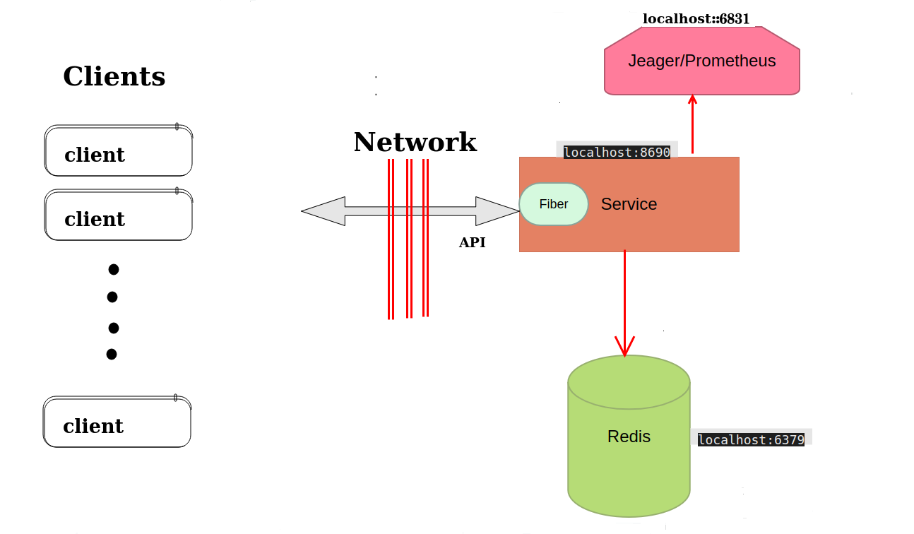

# Arvan-Qoute

This application is responsible to for implement Arvan Qoute.

This is a "microservice" application intended to be part of a microservice architecture.

## Architecture



## Development

To start your application in the dev profile, run:

```
go run main.go
```

## Building for production

### Packaging as executable file

To build the final runnable application, run:

```
go build -o arvan-qoute-biz main.go
```

## DevOps

### Health 

To check service health status use following link:

```
/api/v1/health
curl -XGET http://localhost:8690/api/v1/health
## response 
{
  "ok" : true
}
```
### Service info 
To check service info use following link:

```
/api/v1/info
curl -XGET http://localhost:8690/api/v1/info
##response
{
		"name":      "Arvan-Qoute-Service",
		"desc":      "contact business logic service",
		"tech-used": "go 1.21",
		"version":   "1.0.1",
}
```

### Functionality test
```
```
###

### PHONE 
```
curl -XPOST http://localhost:8690/api/v1/add?uuid=12345678&username=arvan
{
"qoute":" Example Qoute"
}

```


